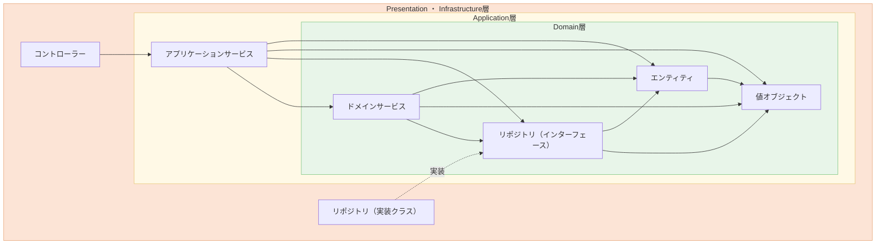

# eラーニング管理システム（ELMS） — バックエンド

受講生がオンラインでコース・レッスンを学習し、管理者がコース・ユーザー・お知らせを管理できる eラーニングプラットフォームのバックエンド API サーバーです。

## 技術スタック

| 分類 | 技術 |
|---|---|
| 言語 | Java 21 |
| フレームワーク | Spring Boot 3.5.8 |
| DB アクセス | Spring Data JDBC（JPA は不使用） |
| DB | PostgreSQL 17 |
| マイグレーション | Flyway |
| 認証 | JWT（HttpOnly Cookie）+ RefreshToken |
| パスワード | BCrypt |
| メール送信 | Spring Mail（開発環境は Mailpit） |
| ファイルストレージ | ローカルディスク（開発）/ AWS S3（本番） |
| API ドキュメント | Springdoc OpenAPI (Swagger UI) |
| コードフォーマット | Spotless / Google Java Format |
| アーキテクチャ検証 | ArchUnit |
| テスト | JUnit 5 + Testcontainers（PostgreSQL） |
| アーキテクチャ | オニオンアーキテクチャ + DDD（Presentation / Application / Domain / Infrastructure） |

## 機能一覧

**一般ユーザー（GENERAL ロール）**
- コース一覧・詳細閲覧
- レッスン視聴・受講完了マーク
- お知らせ一覧・詳細閲覧
- アカウント情報更新・パスワード変更
- パスワードリセット（メール認証）

**管理者（ADMIN ロール）**
- コース CRUD・サムネイル設定
- レッスングループ CRUD
- レッスン CRUD・並び順変更
- ユーザー CRUD・CSV インポート / エクスポート
- お知らせ CRUD
- ファイルアップロード（画像）
- 全レッスン CSV エクスポート

## 前提条件

- Java 21
- Docker / Docker Compose

## セットアップ

### 1. 環境変数ファイルを作成

```bash
cp .env.dev.example .env
```

`.env` の主な設定項目：

```env
DB_HOST=localhost
DB_NAME=elms_db
DB_USER=root
DB_PASS=pass
DB_PORT=5433
MAIL_HOST=localhost
MAIL_PORT=1025
BASE_URL=http://localhost:3000
JWT_SECRET=<base64エンコードの32バイト以上のシークレット>
COOKIE_SECURE=false
UPLOAD_DIR=uploads
```

> `BASE_URL` はパスワードリセットメール内のリンク先（フロントエンド URL）です。開発時は `http://localhost:3000` を指定してください。

JWT シークレットの生成例：
```bash
openssl rand -base64 32
```

### 2. ミドルウェアを起動

```bash
docker compose -f docker-compose-dev.yml up -d
```

| コンテナ | 用途 | ポート |
|---|---|---|
| elms-db | PostgreSQL 17 | 5433 |
| elms-mailpit | メール確認（Mailpit） | SMTP: 1025 / UI: 8025 |

### 3. アプリケーションを起動

```bash
./gradlew bootRun
```

初回起動時に Flyway が自動でスキーマ作成とシードデータ投入を行います。

サーバーは **http://localhost:8080** で起動します。

## シードデータ（初期アカウント）

| メールアドレス | パスワード | ロール |
|---|---|---|
| kanri@test.com | password | ADMIN |
| ippan@test.com | password | GENERAL |

## API ドキュメント

起動後、以下の URL で Swagger UI を確認できます。

```
http://localhost:8080/swagger-ui/index.html
```

## コーディング規約（バックエンド）

### はじめに

本プロジェクトでは、保守性・拡張性の高いシステムを目指し、以下の原則に基づいた設計と実装を行います。

### アーキテクチャ方針

「**オニオンアーキテクチャ**」を基本とし、以下のレイヤー構成・依存関係を採用します。  
矢印の方向に依存 OK（矢印先のメソッドを呼んでよい、矢印先の型のフィールドを持ってよい）です。



> 破線の矢印は、リポジトリの実装クラスがインターフェースを実装することを表します。

| レイヤー | 依存してよい先 |
|---|---|
| presentation | application |
| application | domain |
| infrastructure | domain |
| domain | なし（他レイヤーに依存しない） |

**禁止される依存の例**

- presentation → infrastructure（コントローラーから Dao を直接呼ばない）
- application → infrastructure（ユースケースから Dao を直接呼ばない）
- domain → application / infrastructure / presentation

### アーキテクチャルール一覧

本プロジェクトでは、以下のルールに従った設計・実装を行います。

#### レイヤー依存ルール（Rule 1〜7）

| Rule | 内容 |
|---|---|
| 1 | presentation 層は infrastructure 層にアクセスしてはならない |
| 2 | application 層は infrastructure 層にアクセスしてはならない |
| 3 | application 層は presentation 層にアクセスしてはならない |
| 4 | domain 層は application 層にアクセスしてはならない |
| 5 | domain 層は infrastructure 層にアクセスしてはならない |
| 6 | domain 層は presentation 層にアクセスしてはならない |
| 7 | infrastructure 層は presentation 層にアクセスしてはならない |

#### 命名・構成ルール（Rule 8〜20）

| Rule | 内容 |
|---|---|
| 8 | `presentation.request` パッケージのクラスは `Request` で終わること |
| 9 | `@RestController` 付きクラスは `Controller` で終わること |
| 10 | `application.service` の **インターフェース** は `ApplicationService` で終わること |
| 11 | `application.service` の `@Service` クラスは `ApplicationServiceImpl` で終わること |
| 12 | `application.command` パッケージのクラスは `Command` で終わること |
| 13 | `application.dto` パッケージのクラスは `Dto` で終わること |
| 14 | `domain.repository` の **インターフェース** は `Repository` で終わること |
| 15 | `infrastructure.repository` の `@Repository` クラスは `RepositoryImpl` で終わること |
| 16 | `@RestController` 付きクラスは `@RequestMapping` を持つこと |
| 17 | `@RestController` 付きクラスは Swagger の `@Tag` を持つこと |
| 18 | `infrastructure.repository` のクラス（インターフェース以外）は `@Repository` を持つこと |
| 19 | `domain.service` の **インターフェース** は `DomainService` で終わること |
| 20 | `domain.service` のクラス（インターフェース以外）は `DomainServiceImpl` で終わること |

### ドメイン駆動設計（DDD）の指針

本プロジェクトは、ドメイン駆動設計（DDD）を採用しています。

#### 参考書籍

「ドメイン駆動設計」について、全く知らないという方は、以下の書籍がわかりやすくまとまっていて、かつ読みやすいのでおすすめです。

- 『ドメイン駆動設計』Eric Evans 著（角川書店）

#### DDD の各用語の説明

**ドメイン**  
業務知識や業務上のルールのことを言います。  
例えば、「ユーザー名は全角文字は禁止で、〇文字以内でなければいけない」といったルールや、「ユーザー名」自体のことをドメインと言います。

**ドメインオブジェクト**  
ドメインをオブジェクト（クラス）で表現したもののことを言います。

ドメインオブジェクトには種類があり、以下は全てドメインオブジェクトに該当します。（それぞれの役割は後述します）

- 値オブジェクト（バリューオブジェクトとも言う）
- エンティティ
- ドメインサービス

#### 値オブジェクト（バリューオブジェクト）

ドメインオブジェクトの一つで、システム固有の値を表したオブジェクトです。

例えば、メールアドレス、ユーザー名、サムネイル画像 URL 等が値オブジェクトに該当します。

**値オブジェクトの性質**

- **不変である。**  
  値オブジェクトの内部のフィールドは一度代入したら変更できません。そのため、フィールドには `final` をつけて Setter メソッドも定義しません。この性質により、メソッドの引数に値オブジェクトのインスタンスを渡したら、いつの間にか状態が変更されていた、ということに起因するバグを防げます。値オブジェクトを変更したいときは、インスタンスごと生成し直します。

- **等価性によって比較される。**  
  値オブジェクトの `equals` メソッドを実装して、その `equals` メソッド内の処理では、構成するフィールドが同じ値なら値オブジェクト同士は等価とするようにします。この性質により、値オブジェクト内にフィールドが追加されても、自身の `equals` メソッド内にコードを 1 行追加するだけでよくなります。値オブジェクトを使う側に `equals` を足さなくていいということです。

**値オブジェクトを使うか、プリミティブ型を使うかの基準**

「そこにルールが存在するか否か」で判断する。もしルール（〇文字以内でなければいけない等）が存在するなら値オブジェクトを作る。ルールが存在しないならプリミティブ型でもよい。

**値オブジェクトを使うメリット**

- **表現力を増す。** 値オブジェクトに振る舞いが定義されていることで、どういうルールを持つ値なのかの仕様をクラスとして表現できる。
- **誤った代入を防ぐ。** 値オブジェクトはプリミティブ型でなく独自のクラス型として定義するため、代入しようとしている型が違えばコンパイル時点でエラーになり、気づくことができる。
- **不正な値を存在させない。** コンストラクタで不正な値なら例外を発生させるようにするため、適切な値しか入りえない。ただ、それ以前にクライアント側で事前に不正な値でないかを検査しておくのがベスト。
- **ロジックの散在を防ぐ。** コンストラクタでチェック処理があるので、値オブジェクトを使う側で値のチェック処理が不要になる。

#### エンティティ

ドメインオブジェクトの一つで、「見た目や中身が同じでも一意に識別できるもの」を表したオブジェクトです。要はフィールドに ID を持つようなクラスは、エンティティです。

例えば、ユーザー、お知らせ等がエンティティに該当します。エンティティのフィールドに値オブジェクトを持つことは可能です。

**エンティティの性質**

- **可変である。**  
  人間が持つ年齢といった属性が変化するのと同じように、エンティティのフィールドは変化することが許容されています。エンティティのフィールドの値を変更する場合は、自身のメソッドを通じて変更する（値オブジェクトのようにインスタンス自体を変更する必要はなく、フィールドの変更で OK）。しかし、すべての属性を可変にする必要はなく、可能な限り不変にしておくほうがよい。

- **同じフィールド値であっても区別される。**  
  エンティティ同士を区別するためには識別子（いわゆる ID。識別子は可変にする必要はなく、再代入不可能にするとよい）が利用される。フィールド値では区別されない。

**値オブジェクトとエンティティのどちらにするべきかの判断基準**

ライフサイクルを持たない、またはシステムにとってライフサイクルを表現することが無意味である場合は、値オブジェクトとして取り扱う。

ライフサイクルを持たない、つまり不変な値は不変なオブジェクトのままにして取り扱う方がシステム的に必要以上に複雑にならないという理由から良い。（可変というのは複雑性につながる）

#### ドメインサービス

ドメインオブジェクトの一つで、値オブジェクトやエンティティに定義すると違和感の生じる振る舞い（＝主にドメインの活動を表現するような振る舞い）を定義するオブジェクト。  
しかし、値オブジェクトやエンティティに定義しても違和感の生じない振る舞いは、極力、値オブジェクトやエンティティに定義すること。  
また、ドメインサービスは状態を持たないようにする。（状態は値オブジェクトもしくはエンティティで持つ）

**ドメインサービスに定義するメソッドの例**

ユーザー名の重複確認を行うメソッド。  
もし、このメソッドをユーザーエンティティに定義すると、重複確認対象ユーザー自身が重複確認問い合わせするのは変なので、ドメインサービスに定義すべき。

**ドメインサービスの命名規則**

`ドメインの概念 + DomainService` とする。  
例：`UserDomainService`

#### リポジトリ

リポジトリとは、データの保管庫という意味。データを永続化したり再構築するといった処理を抽象的に扱うためのオブジェクト。

**リポジトリのメリット**

- データストア（DB などのデータの保管庫）を操作するコードをリポジトリに切り離すことで、処理の内容をぼやけさせるのを回避する。（ビジネスロジック内にデータの永続化処理が書かれてあると何をしているのか処理がぼやけてしまう）
- データストアにまつわる処理をリポジトリに寄せることで、データストアの差し替えも可能になる。（例えば、PostgreSQL から MySQL への移行など）

**リポジトリを実装する上で注意したい点**

- ドメインのルールはリポジトリの責務でないので、ドメインオブジェクトに行ってもらうこと。
- リポジトリに定義する振る舞い（メソッド）の引数について、永続化（INSERT、UPDATE）や削除（DELETE）を行う場合、引数にオブジェクトを渡すようにする。更新する項目だけを引数に渡すと、いろんな引数パターンの永続化メソッドが乱立することになってしまうため。
- 検索（SELECT）を行う場合は、基本的には識別子（ID）を引数に取るようにする。識別子以外を引数にとっても OK。
- リポジトリのメソッドを呼び出していいのは、アプリケーションサービスとドメインサービスのみ。
- リポジトリのメソッドの中で、ドメインサービスのメソッドを呼び出してはいけない。値オブジェクトやエンティティのメソッドを呼び出すのは OK。

値オブジェクトやエンティティは単なるデータ構造のため、リポジトリがそれを扱うのは自然である。例えば、工具（リポジトリ）がネジ（値オブジェクト）を使って家具（エンティティ）を組み立てるようなもの。

一方で、ドメインサービスはビジネス判断の主導権を持っているため、それをリポジトリが呼び出してしまうと、データアクセス層がビジネス判断に関与することになってしまう。例えば、「工具（リポジトリ）が、家具の設計図を書いてる職人（ドメインサービス）に命令する」ようなもの。

#### アプリケーションサービス

アプリケーションサービスとは、ドメインオブジェクトが行うタスクの進行を管理し、問題の解決に導くもの。つまり、ドメインオブジェクトのメソッドを呼び出す役割がある。

ユースケースを実現するオブジェクトとも言える。

- ユーザーを登録するユースケース
- ユーザーを変更するユースケース
- ユーザーを取得するユースケース
- ユーザーを退会するユースケース

**アプリケーションサービスを実装する上で注意したい点**

- アプリケーションサービスは、あくまでもドメインオブジェクトのタスク調整に徹するべきで、アプリケーションサービスにドメインのルールは記述されるべきではない。
- アプリケーションサービスに登録や更新メソッドを定義する場合、登録や更新用の「コマンドオブジェクト」を作成し、それをアプリケーションサービスのメソッドの引数に指定する。これにより、複数の更新メソッドの乱立を防ぐことができる。

**アプリケーションサービスで行うこと**

- アプリケーションサービスのメソッドの引数で、取得 or 削除の場合は識別子を受け取り、登録・更新の場合はコマンドオブジェクトを受け取る。
- アプリケーションサービスのメソッド内では、
  - ドメインオブジェクトを `new` する。
  - ドメインサービスのメソッドを呼び出す。
  - リポジトリのメソッドを呼び出す。
  - 状況に応じて例外を発生させる。
- アプリケーションサービスのメソッドの戻り値は、DTO もしくは `void` とする。

### パッケージ構成とクラスの命名ルール

#### application

| パッケージ | 配置するもの | 命名規則 |
|---|---|---|
| `command` | アプリケーションサービスのメソッドの引数に指定するコマンドオブジェクト | `～Command` |
| `dto` | アプリケーションサービスのメソッドが戻り値として返す DTO | `～Dto` |
| `converter` | ドメインオブジェクト ⇔ DTO の変換を担うクラス | `～DtoConverter` |
| `service` | アプリケーションサービスのインターフェースおよび実装クラス | インターフェース: `ドメインの名前 + ApplicationService` / 実装: `ドメインの名前 + ApplicationServiceImpl` |

`service` パッケージでインターフェースを用意している理由は、フロントエンドとバックエンドの実装者が異なる場合、バックエンドの実装待ちにならずにモックでテストできるようにするため。

#### domain

| パッケージ | 配置するもの | 命名規則 |
|---|---|---|
| `model` | 値オブジェクトやエンティティ | — |
| `repository` | リポジトリのインターフェース | `ドメインの名前 + Repository` |
| `service` | ドメインサービスのインターフェースおよび実装クラス | インターフェース: `ドメインの名前 + DomainService` / 実装: `ドメインの名前 + DomainServiceImpl` |

`repository` のインターフェースを `domain` に置く理由は、データソースに何を使用するかという具体的な情報（実装クラス）は `infrastructure` の責務であるため。インターフェースではデータソースに何を使用するかという具体的な実装はしないため、`domain` パッケージが適切。

`repository` でインターフェースを用意している理由は、DB がまだ準備できていない場合に、モックでテストできるようにするため。

`service` にドメインサービスの実装クラスを置く理由は、ドメインサービス内ではリポジトリを使用する可能性があり、Bean をフィールドに代入することになるため。

#### infrastructure

| パッケージ | 配置するもの | 命名規則 |
|---|---|---|
| `dao` | データソースへの取得・作成・更新・削除を担うクラス（例: DB であれば SQL 実行） | `ドメインの名前 + Dao` |
| `repository` | リポジトリの実装クラス | `ドメインの名前 + RepositoryImpl` |
| `security` | 認証・認可に関するクラス | — |

#### presentation

| パッケージ | 配置するもの | 命名規則 |
|---|---|---|
| （ルート） | API のエントリーポイントとなるコントローラー | `～Controller` |
| `request` | API のリクエストを受け取るためのオブジェクト | `～Request` |
| `response` | API のレスポンスのオブジェクト | `～Response` |

`response` について：アプリケーションサービスのメソッドの戻り値（DTO）と内容が変わらなければ、DTO をそのまま API のレスポンスとして返してよい。

### 命名ルール

メソッド名に関しては、以下のページを参考にしてください。一般的に望ましいとされているメソッド名であれば問題ありません。

https://qiita.com/KeithYokoma/items/2193cf79ba76563e3db6

## プロジェクト構成

```
src/main/java/com/everrefine/elms/
├── config/                # Spring 設定（S3、Swagger、シードデータ等）
├── presentation/
│   ├── controller/        # REST コントローラー
│   ├── request/           # リクエストクラス
│   ├── response/          # レスポンスクラス（ErrorResponse 等）
│   ├── exception/         # グローバル例外ハンドラー
│   └── scheduler/         # 定期実行ジョブ
├── application/
│   ├── command/           # ユースケース入力
│   ├── dto/               # ユースケース出力
│   ├── exception/         # アプリケーション例外
│   └── service/           # ユースケース実装
├── domain/
│   ├── model/             # エンティティ・値オブジェクト
│   ├── repository/        # リポジトリインターフェース
│   └── service/           # ドメインサービス
└── infrastructure/
    ├── dao/               # Spring Data JDBC インターフェース
    ├── repository/        # リポジトリ実装
    └── security/          # JWT フィルター・Spring Security 設定
src/main/resources/
├── application.yml        # 共通設定
├── application-dev.yml    # 開発環境設定（ローカルファイルストレージ）
├── application-prd.yml    # 本番環境設定（S3 使用）
└── db/migration/          # Flyway マイグレーションスクリプト
```

## データベースのリセット

開発中にスキーマやシードデータを変え直したい場合は、コンテナごと削除して再起動します。

```bash
docker compose -f docker-compose-dev.yml down -v
docker compose -f docker-compose-dev.yml up -d
./gradlew bootRun
```

## メール確認（Mailpit）

パスワードリセットメールなど、開発環境で送信されたメールは Mailpit でキャッチできます。

```
http://localhost:8025
```

## コードフォーマット

```bash
./gradlew spotlessApply
```

## テスト

```bash
./gradlew test
```

テストは Testcontainers で PostgreSQL コンテナを自動起動して実行します（Docker が必要です）。
